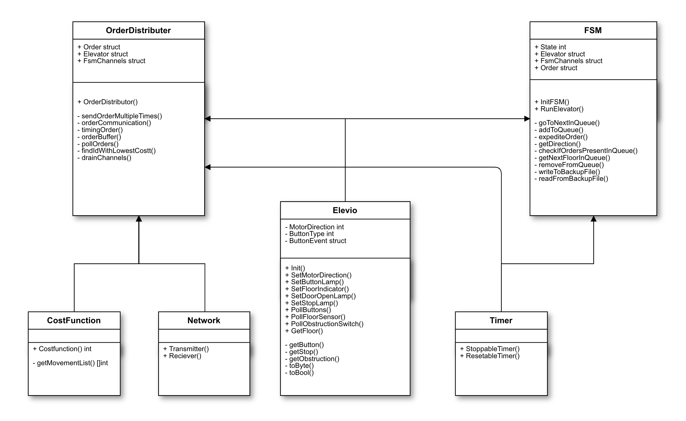
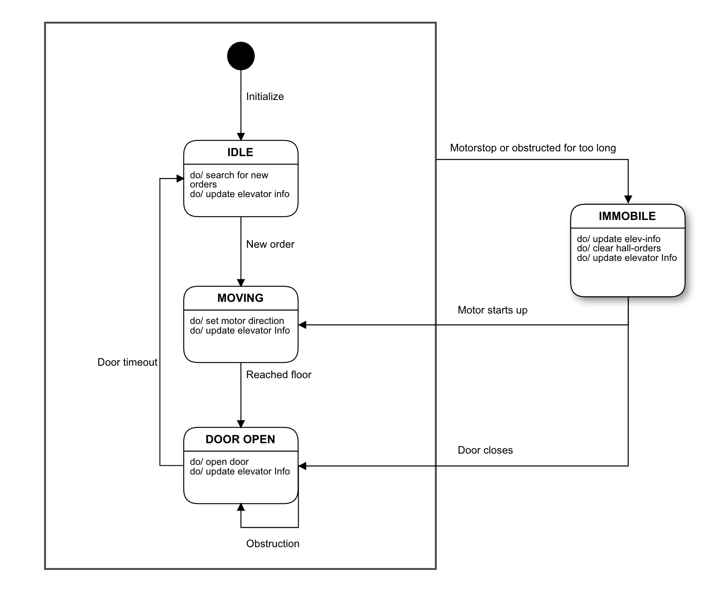

# Multiple elevator project - TTK4145

### Summary of project

The objective of this project was to create a system of multiple elevators that take orders and communicate over network in accordance to the requirements specification given [here.](https://github.com/TTK4145/Project) The project is written in Go. 

We've chosen to solve the project by creating a Finite State Machine (fsm-module) that handles the logic of executing orders for a single elevator. The FSM handles fault tolerance logic for a single elevator such as motorstop, obstruction and loading and saving cab-orders to file in case of system crash. 

The OrderDistributer is the module that handles the interaction between the elevators. It communicates with the other elevators using the Network-module, and decides which elevator should take an order by using the costfunction-module. After it has been decided, if the order is its own, it then sends that to the FSM. Otherwise, it starts a timer on the order. In the case where it doesn't get a "Done" message from another elevator before  the timer times out, it will send it to it's own FSM. This secures fault-tolerance for orders, as all orders are exexuted by some elevator no matter what. 

### Module overview

Here you will find some informal UML. The state diagram shows how our four states interact in the FSM, and the module-diagram shows which modules we have and what they consist of. 

### Loaned code

* elevator_io.go
* bcast.go

